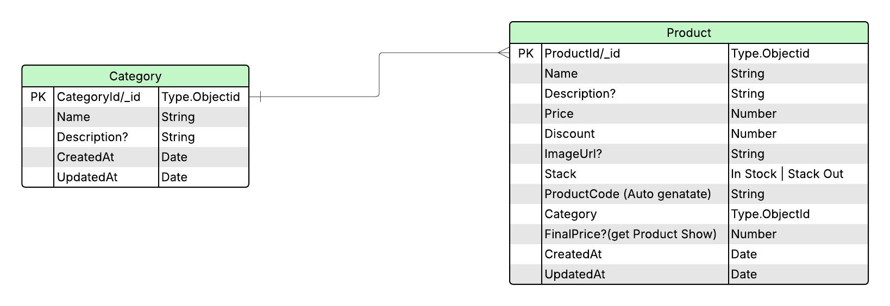

# 📦 Product Management System

A complete backend API for managing products and categories, built with **Node.js**, **Express.js**, **TypeScript**, **MongoDB**, and **Cloudinary** for image uploads. The system supports full **CRUD operations**, product image handling, and pagination/filtering/sorting.

---

## 🚀 Live API

🔗 [https://product-management-system-orcin.vercel.app/api/v1/](https://product-management-system-orcin.vercel.app/api/v1/)

---

## 📁 GitHub Repository

🔗 [https://github.com/saurav11sarkar/note-organizer-application](https://github.com/saurav11sarkar/note-organizer-application)

---

## 📸 Entity Relationship (ER) Diagram

## 

## 🛠 Tech Stack

- **Backend:** Express.js, Node.js, TypeScript
- **Database:** MongoDB + Mongoose
- **Validation:** Zod Schema Validation
- **File Upload:** Multer + Cloudinary
- **ORM/ODM:** Mongoose
- **Environment Variables:** Dotenv

---

## 📦 Features

✅ Category CRUD operations
✅ Product CRUD operations
✅ Image upload to Cloudinary
✅ Auto-generated unique Product Codes
✅ Filtering, Searching, Sorting, Pagination
✅ Centralized Error Handling
✅ Zod-based request validation

---

## 📂 Project Structure

```
├── config/
├── modules/
│   ├── category/
│   └── product/
├── utils/
├── middlewares/
├── error/
├── router/
├── app.ts
├── server.ts
└── .env
```

---

## 📌 Environment Variables

```env
NODE_ENV=development
PORT=5000
DB_URI=<your_mongodb_uri>
CLOUDE_NAME=<your_cloudinary_name>
CLOUDE_API_KEY=<your_cloudinary_api_key>
CLODUE_API_SECRET=<your_cloudinary_api_secret>
```

---

## ⚙️ Setup Instructions

1. **Clone the repository:**

```bash
git clone https://github.com/saurav11sarkar/note-organizer-application.git
cd note-organizer-application
```

2. **Install dependencies:**

```bash
npm install
```

3. **Create \*\***`.env`\***\* file:**

```bash
touch .env
# Add environment variables shown above
```

4. **Run the server:**

```bash
npm run dev
```

---

## 📮 API Endpoints

### Category Routes

- `POST /api/v1/category` - Create category
- `GET /api/v1/category` - Get all categories (filterable, paginated)
- `GET /api/v1/category/:id` - Get category by ID
- `PUT /api/v1/category/:id` - Update category
- `DELETE /api/v1/category/:id` - Delete category

### Product Routes

- `POST /api/v1/product` - Create product with optional image
- `GET /api/v1/product` - Get all products (searchable, paginated)
- `GET /api/v1/product/:id` - Get product by ID
- `PUT /api/v1/product/:id` - Update product (status, discount, description)
- `DELETE /api/v1/product/:id` - Delete product

---

## 🧠 Author & Credit

👤 **Saurav Sarkar**
📧 [sauravdev2411@gmail.com](mailto:sauravdev2411@gmail.com)

---

## 🌟 Show your support

Give a ⭐️ if this project helped you!

---

## 📜 License

This project is licensed under the MIT License.
